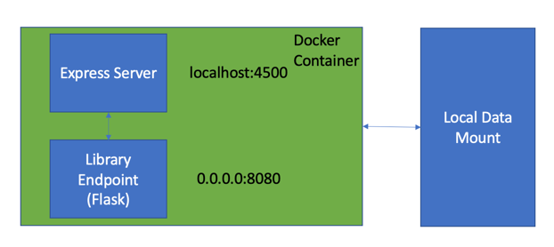
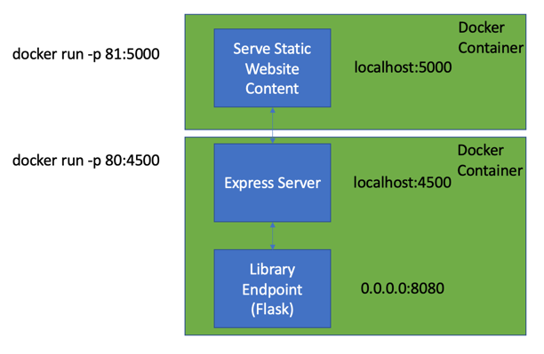
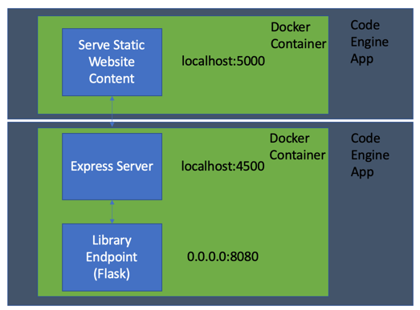

# Amhairc – A toolkit for the auto generation of best practice charts.

Amhairc is a toolkit that reads raw data and generates both the best chart to display your data. The output chart is designed to include the best practice of Data Visualisation (Gestalt theory and Pre-attentive attributes)

The initial toolkit provides four possible chart outputs: Bar Chart, Histogram, Line Chart and Scatter plot. We hope that teams find this toolkit useful and build upon the initial quartet of charts.

# File Structure Explained
/data/datafiles - some example csv files that can be used as input

/src/amhairc/* - the library code that is the same as the pip install.

/src/amhairc.py - used when running without a UI. 
/src/api.py - flask endpoint for the amhairc library code, used when deployed.

/web - the web folder containing a React App that illustrates the use of the library.

/windows - docker build commands for those using windows.

/Makefile - the makefile that is used to build the docker images and the run the docker containers.

/requirements.txt - the python packages needed that is used when building the base images.
/setup.py - setuptools file with version information.

/Dockerfile.base - Creates the base docker image for the non ui run using the command "make build-base"
/Dockerfile - Create the docker image for the non ui run.

/Dockerfile.intbase - Creates the base docker image for the ui run using the command "make build-base-integrated".
/Dockerfile.web - Create the web docker image for the ui run
/Dockerfile.api - Creates the server docker image for the ui run , for the express server and the flask library endpoint.
/start.sh - Start script used in the server docker image
/start_web.sh - Start script used in the web docker image

# Running Headless
When running without a User Interfcae, a docker container will run the /src/amhairc.py script inside a continer with a mounted data point locally.
This mount point location is configured using the DATA_PATH variable in the /Dockerfile

When running locally you need to build the local image and run the container.
1. Run 'make build-base' 
2. Run 'make build'.
3. Run 'make local'.
4. You can observe the output in the DATA_PATH folder set in your Dockerfile. All charts are generated using sample data.

# Running Locally With User Interface
When running locally with a user interface you will run 2 docker containers.
1. Run 'make build-integrated-base'
2. Run 'make build-web'.
3. Run 'make build-api'.
4. Run 'make run-web'.
5. Run 'make run-api'.
6. Navigate to the UI http://localhost:81 

# Running in IBM Code Engine With User Interface
When running locally with a user interface you will run 2 docker containers.

## 1. Build the docker images an
1. Run 'make build-integrated-base'
1. Run 'make build-web'.
2. Run 'make build-api'.
3. Run 'make run-web'.
4. Run 'make run-api'.

## 2. Push code to your docker registry
Push web to IBM Clloud docker registry
1. ogin to IBM Cloud ibmcloud login –sso
2. ibmcloud cr region-set us-south ( your own region )
3. ibmcloud cr login
4. docker tag amhairc-web:0.1.2 us.icr.io/amhairc/amhairc-web:0.1.2
5. docker push us.icr.io/amhairc/amhairc-web:0.1.2
6. docker tag amhairc-api:0.1.2 de.icr.io/amhairc/amhairc-api:0.1.2
7. docker push de.icr.io/amhairc/amhairc-api:0.1.2

